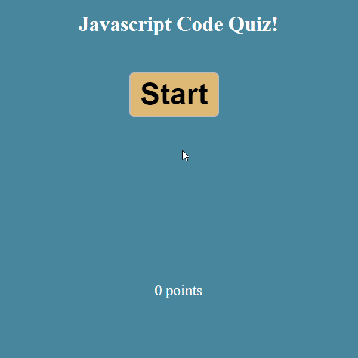

# Code_Quiz
Javascript Fundamentals Quiz

[[Repository Link](https://github.com/ElusiveSkies/Code_Quiz)]

[[Deployed Code Quiz](https://elusiveskies.github.io/Code_Quiz)]

## Table of Contents

- [Description](#Description)
- [Usage](#Usage)
- [License](#License)
- [Questions](#Questions)

## Description
A timed quiz, starting when the user clicks the start button.
Created using HTML, CSS, and JavaScript.

## Usage

Video of Usage

## License

MIT

## Questions

[[Contact me](mailto:elusiveskies@gmail.com)]

[[Elusiveskies](https://www.github.com/Elusiveskies)]